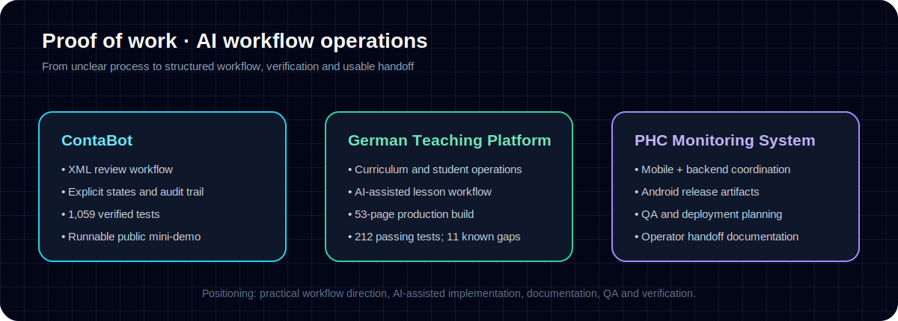

# AI Workflow & Operations Portfolio

[](https://github.com/Cheliotop/ai-workflow-portfolio/actions/workflows/verify-demo.yml)

**Sergio Hoeckh · practical workflow design, AI-assisted implementation, QA, documentation, and handoff.**

I turn unclear operational problems into structured systems that another person can understand, test, and use.



## Start here

| Project | Evidence | Explore |
|---|---|---|
| **ContaBot** | Deterministic XML review workflow; 1,059 tests passed, 2 skipped, 135 subtests passed | [Case study](case-studies/01-contabot-review-workflow.md) · [Run the public demo](demo/contabot-mini/) · [Diagram](assets/contabot-workflow.svg) |
| **German Teaching Platform** | 53-page production build; 212 tests passed with 11 documented contract-drift failures | [Case study](case-studies/02-german-teaching-platform.md) · [Workflow map](assets/german-platform-workflow.svg) |
| **PHC Monitoring System** | Android APK artifacts, release/QA documentation, backend and operator handoff planning | [Case study](case-studies/03-phc-monitoring-system.md) · [Release-flow map](assets/phc-release-flow.svg) |

## Runnable proof

The [ContaBot Mini demo](demo/contabot-mini/) uses fake XML and only the Python standard library to demonstrate:

`parse → validate → route to review → append decision → export audit summary`

```bash
cd demo/contabot-mini
python3 -m unittest discover -s tests -v
python3 contabot_demo.py sample-data/sample-invoice.xml --decision approve
```

GitHub Actions runs the tests and exercises the workflow on every push.

## What these projects show

- Translating messy operational requirements into explicit workflows and states
- Using AI-assisted implementation without surrendering QA or judgment
- Writing tests, verification notes, runbooks, and implementation handoffs
- Separating verified behavior from assumptions and future plans
- Designing for the operator who has to use and maintain the result

## My role

My contribution is workflow direction, product and operations thinking, AI-assisted implementation, documentation, testing criteria, and verification. I do not claim that every line was manually typed without AI; I claim the decisions, boundaries, review, and responsibility for the resulting work.

## Verification and boundaries

Read the [project verification summary](docs/verification-summary.md) for the exact commands, results, and limitations behind the claims above.

Original workspaces remain private when they contain credentials, client/business context, deployment details, or unfinished internal material. Everything here is a sanitized, employer-facing representation using fake or bounded evidence.

## Contact

[LinkedIn](https://www.linkedin.com/in/sergio-hoeckh-851410372/) · [Email](mailto:sergiopro001@gmail.com) · [GitHub profile](https://github.com/Cheliotop)
