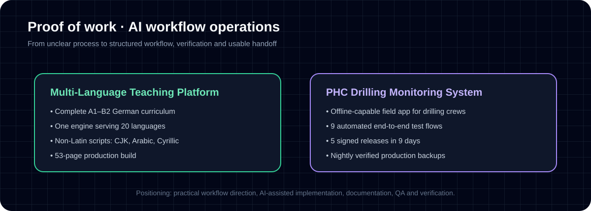

# AI Workflow & Operations Portfolio

[](https://github.com/Cheliotop/ai-workflow-portfolio/actions/workflows/verify-demo.yml)

**What this proves:** I turn unclear operational problems into workflows that are tested, documented, and handed off — not claimed. Two real client systems, one runnable demo, and verification notes instead of assurances.

**Sergio Hoeckh** · practical workflow design, AI-assisted implementation, QA, documentation, and handoff.



## Start here

| Project | Evidence | Explore |
|---|---|---|
| **Multi-Language Teaching Platform** | Row Level Security on 25 of 25 tables, zero findings from Supabase's security advisor; 140-lesson A1–B2 curriculum spine; one engine serving 20 languages | [Case study](case-studies/01-german-teaching-platform.md) · [Workflow map](assets/german-platform-workflow.svg) |
| **PHC Drilling Monitoring System** | 9 automated end-to-end mobile test flows; 5 signed releases in 9 days; nightly production backup automation; staged 6-pass hardening program | [Case study](case-studies/02-phc-monitoring-system.md) · [Release-flow map](assets/phc-release-flow.svg) |

## Runnable proof

Client work is private. This part isn't — the [review workflow demo](demo/review-workflow-mini/) uses fake data and only the Python standard library, so you can execute it yourself in under a minute:

`parse → validate → route to review → append decision → export audit summary`

```bash
cd demo/review-workflow-mini
python3 -m unittest discover -s tests -v
python3 review_demo.py sample-data/sample-invoice.xml --decision approve
```

GitHub Actions runs the tests and exercises the workflow on every push.

## What these projects show

- Translating messy operational requirements into explicit workflows and states
- Using AI-assisted implementation without surrendering QA or judgment
- Writing tests, verification notes, runbooks, and implementation handoffs
- Separating verified behavior from assumptions and future plans
- Designing for the operator who has to use and maintain the result

## My role

My contribution is workflow direction, product and operations thinking, AI-assisted implementation, documentation, testing criteria, and verification. I do not claim that every line was manually typed without AI; I claim the decisions, boundaries, review, and responsibility for the resulting work.

## Verification and boundaries

Read the [project verification summary](docs/verification-summary.md) for the exact commands, results, and limitations behind the claims above.

Original workspaces remain private when they contain credentials, client/business context, deployment details, or unfinished internal material. Everything here is a sanitized, employer-facing representation using fake or bounded evidence.

## Contact

[LinkedIn](https://www.linkedin.com/in/sergio-hoeckh-851410372/) · [Email](mailto:sergiopro001@gmail.com) · [GitHub profile](https://github.com/Cheliotop)
