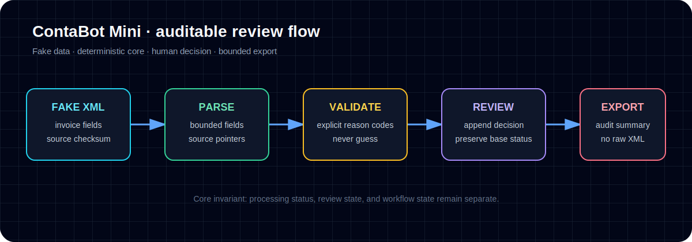

# Case Study 1 — ContaBot / Accounting XML Review Workflow



**Public proof:** [Run the fake-data ContaBot Mini demo](../demo/contabot-mini/) to inspect the workflow and execute its tests without credentials or private accounting data.

## Problem

Accounting and invoice-processing workflows need more than basic parsing. They need validation, review states, auditability, export boundaries, and a clear path from raw document input to human-reviewed output.

The risk in this type of workflow is not just technical failure. The bigger risk is operational confusion: unclear statuses, hidden assumptions, lost review decisions, and no reliable way to explain what happened to a record.

## My role

I structured and verified the local workflow as a deterministic processing pipeline with clear boundaries between parsing, validation, persistence, review, and export.

This is relevant to AI workflow operations because it shows the kind of system thinking needed when automation touches sensitive business records: the workflow must be explainable, testable, and reviewable.

## Workflow/system designed

The implemented runtime scope is:

```text
parse -> validate -> map -> persist -> review -> export
```

Key concepts:

- immutable initial validation status;
- derived review state;
- workflow state projection;
- append-only review decisions;
- operator-facing review surface;
- export boundaries;
- tenant/isolation and governance-style metadata foundations.

## Tools used

- Python
- Pytest
- Local file/database workflow patterns
- Structured test fixtures
- Documentation for operator flow and state model

## Verification evidence

Latest local verification:

```text
1059 passed, 2 skipped, 135 subtests passed in 58.07s
```

The test run used an isolated Python 3.11 virtual environment and skipped live Postgres/browser checks. The passing tests verify the core local deterministic workflow.

Useful proof artifacts in the private/local project:

- `README.md` — runtime scope and boundaries
- `docs/STATE_MODEL.md` — status/review/workflow state model
- `docs/OPERATOR_GUIDE.md` — operator review flow
- `tests/` — broad fixture-driven test coverage

## Business value

ContaBot demonstrates that I can help design AI/automation-adjacent workflows where correctness and reviewability matter. It is a strong fit for operations, QA, documentation, implementation support, and automation roles where a team needs structured process thinking, not just a quick prototype.

## Honest limitations

This public case study does not expose real accounting data or private compliance details. Browser UI and live Postgres checks were not part of the latest verification run.

## Next improvement

Extend the public demo with a tiny browser-based review screen while keeping the deterministic Python workflow and fake-data boundary unchanged.
