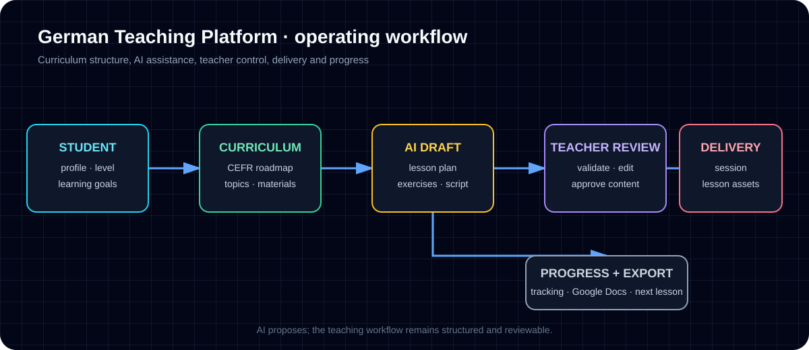

# Case Study 1 — Multi-Language Teaching Platform / AI-Assisted Teaching Operations



## In plain terms

A private language tutor spends more time on preparation and admin than on actual teaching — planning every lesson, remembering where each student left off, building exercises, writing progress notes.

This platform absorbs that work. It holds a complete A1–B2 German curriculum, generates lesson plans and exercises tuned to where a specific student actually is, and tracks their progress across sessions. The same engine runs twenty languages, including non-Latin scripts — Japanese, Chinese, Korean, Arabic, Russian, Hindi — with German built out as the finished flagship and the rest generated through the same process.

It's the operations layer around teaching, not a pile of AI-generated worksheets.

## Problem

AI will happily generate a language lesson. That is not the problem worth solving.

The problem is that a tutor teaching a dozen students needs to know where each one is in a curriculum, what they struggled with last week, what to teach next and why, and to produce materials for it — every week, for every student, forever. Generated lessons that ignore that context are worksheets, not teaching.

So the hard part was never the generation. It was building the structure that makes generation useful: a curriculum with a defined order, a record of where each student sits within it, and enough state that the next lesson follows from the last one.

## My role

I designed and built the system, AI-assisted throughout, and did the work that makes AI assistance safe to depend on: deciding the curriculum's structure, defining what correct looks like, and verifying the result against something other than my own opinion.

The security work in this case study is a fair example. I did not assess my own configuration and declare it good — I ran Supabase's security advisor, took the 14 findings it returned, fixed them in a tracked migration, and re-ran it to confirm zero. The tool disagreeing with me is the point.

## Workflow/system designed

**One engine, twenty languages.** The curriculum, lesson generation, student tracking and export flows are language-agnostic; a language pack plus a student's chosen explanation language configures the whole system. German is built out completely as the flagship; the other nineteen are generated through the same process. Non-Latin scripts — Japanese, Chinese, Korean, Arabic, Russian, Hindi — run on the identical spine rather than a special case.

**A curriculum with a spine, not a pile of topics.** A master sequence of 140 lessons runs Complete Beginner through B2, with each student's position tracked against it and teaching materials and exercises linked to specific lessons in the sequence.

**Generation as a queued job, not a request.** Lesson generation runs through a job table with status and error tracking rather than inline in a request, so a slow or failed AI call degrades one job instead of a page load.

**Security designed in, then checked by something other than me.** Row Level Security on every table, JWT auth with token versioning for revocation, and per-teacher scoping.

## Tools used

- Next.js · React · TypeScript
- Supabase / Postgres with Row Level Security
- Anthropic Claude for lesson planning and teaching-script generation
- Jest for unit and route tests
- Google APIs for document export
- GitHub Actions for scheduled off-site backups

## Verification evidence

Infrastructure verified directly against the live Supabase project on 2026-07-27.

**Row Level Security on 100% of tables — 25 of 25.** Not a sample: every table in the public schema.

**Supabase's own security advisor returns zero findings.** It initially reported 14 warnings, all one class — `function_search_path_mutable`, meaning the caller could influence which schema an unqualified name resolved to inside those functions. I pinned `search_path` on all 14 in a tracked migration and re-ran the advisor:

```text
{"lints":[]}
```

**The schema is documented in the database itself**, not only in a README:

```text
curriculum_sequence   "Master sequence of 140 lessons from Complete Beginner to B2"
student_lesson_progress
                      "Tracks each student progress through the 140-lesson sequence"
ai_lesson_plans       "AI-generated personalized lesson plans using Claude Opus"
teaching_materials    "Comprehensive teaching guides for every curriculum topic"
document_exports      "Tracks all document exports with versioning support"
```

**Backups now exist.** The project runs on a plan with no point-in-time recovery, and its dashboard reported no backups at all. It now has a nightly off-site `pg_dump` workflow that fails loudly rather than producing a green run over an empty file.

**A production build generates 53 static pages** with type checking passing during the build.

## Business value

This is the larger of my two systems and it shows the part of AI-assisted building that actually decides whether the result is usable: giving the AI enough structure to be useful, and enough verification to be trusted.

The strongest signal here is not "I can build a full-stack app." It is that when a tool told me fourteen things were wrong with my security configuration, I fixed all fourteen and re-ran it — and that when the database turned out to have no backups on a plan with no recovery, I treated that as the emergency it was rather than a nice-to-have.

## Honest limitations

**The database is empty.** The schema is deployed and secured, but no curriculum or student data is loaded in it. This platform is built and hardened, not running with content — and I would rather say that plainly than imply an active user base that does not exist.

The repository stays private: environment files and documentation contain credentials and configuration.

The test suite is not quoted here. An earlier version of this case study claimed a specific pass/fail count; that number predates a substantial rewrite of the project and I have not re-run the suite since, so publishing it would be asserting something I have not checked. The infrastructure figures above are all from direct inspection on the date given.

## Next improvement

Seed the curriculum into the live project and run a real pilot with actual students, then re-verify the test suite and publish the number. Once there is data, promote the backup workflow's empty-rows warning to a hard failure — an empty dump will mean something is broken rather than something is unstarted.
