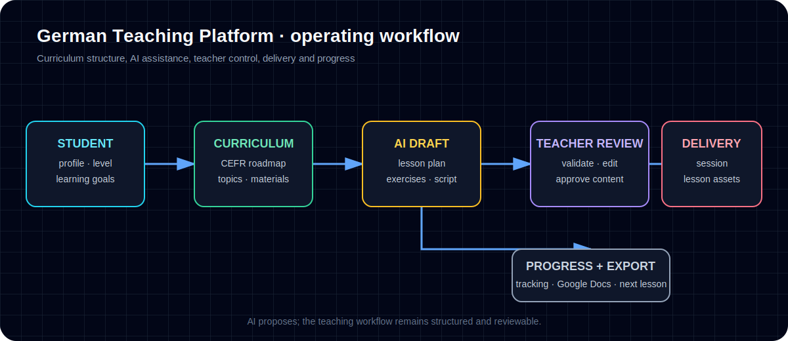

# Case Study 2 — German Teaching Platform / AI-Assisted Teaching Operations



## Problem

A German teaching platform needs more than individual lesson pages. It needs a structured operating system for students, curriculum levels, lesson generation, progress tracking, review workflows, teaching materials, and exports.

The hard part is keeping the system useful for real teaching work instead of becoming a scattered collection of AI-generated text.

## My role

I used AI-assisted development and workflow structuring to help build and organize a full-stack teaching operations platform. The focus was not only code, but the system around it: curriculum structure, student workflows, content validation, documentation, and deployment readiness.

## Workflow/system designed

The project includes:

- student management;
- curriculum roadmap structure;
- AI-assisted lesson generation;
- lesson review workflows;
- teaching materials by level/topic;
- Google Docs export flow;
- authentication and API routes;
- Supabase/database planning;
- deployment and validation documentation.

## Tools used

- Next.js
- React
- TypeScript
- Supabase
- Vitest
- Google APIs
- AI APIs / AI-assisted workflow design
- Netlify deployment configuration

## Verification evidence

Latest local verification after dependency install:

Production build:

```text
Compiled successfully
53 static pages generated
Type checking completed during build
```

Test suite:

```text
212 passed
11 failed
223 total
```

The 11 failures are concentrated in student API route tests where test expectations no longer match current route/schema behavior. This aligns with existing project documentation noting student API fixture/schema drift.

## Business value

This project shows my ability to coordinate a larger AI-assisted software/workflow build: many routes, many docs, curriculum logic, review flow, exports, and validation reports. For employers, the strongest signal is not “I am a senior full-stack engineer,” but that I can help turn a complex workflow idea into a structured platform with documentation, tests, and deployment thinking.

## Honest limitations

The app should not be published raw because local environment files and docs contain private credentials/configuration details. It needs a cleanup pass before any source code is public. Some tests need updating to match the current student API schema.

## Next improvement

Resolve the student API test-contract drift, then create a public-safe walkthrough using synthetic student and lesson data.
