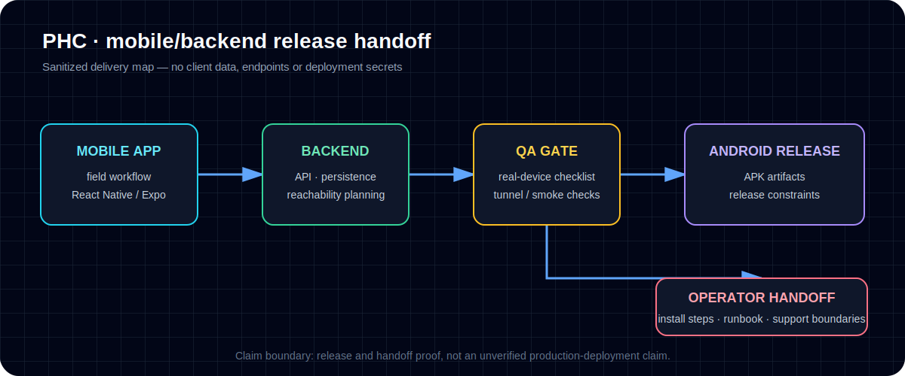

# Case Study 3 — PHC Monitoring System / Mobile + Backend Handoff



## Problem

A field monitoring system needs more than a mobile app screen. It needs a backend, Android packaging, deployment planning, release handoff, operator install instructions, QA steps, and a realistic path from local testing to real-device use.

For this kind of project, the operational handoff matters as much as the code.

## My role

I helped coordinate and document the mobile/backend implementation and release handoff process. The project is included as implementation and operations proof: app structure, backend structure, APK artifacts, release validation, deployment docs, and QA planning.

## Workflow/system designed

The project structure includes:

- React Native mobile app;
- Node.js backend;
- Android APK release artifacts;
- backend deployment docs;
- direct APK handoff docs;
- QA tunnel notes;
- production release checklist;
- operator/admin workflow planning.

## Tools used

- React Native / Expo
- Node.js / Express-style backend
- SQLite/backend persistence planning
- Android APK build/release workflow
- Cloudflare tunnel for QA
- Deployment/runbook documentation

## Verification evidence

PHC was checked read-only only. No files were edited, no dependencies were installed, and no builds were run in the latest check.

Evidence found:

- multiple APK artifacts exist in `releases/`;
- mobile and backend package scripts exist;
- documentation describes QA tunnel setup, direct APK handoff, production release requirements, and real-device QA checklist;
- prior docs record successful TypeScript/lint/build/backend smoke checks and signed QA APK creation.

Important local artifact examples:

```text
releases/PHC_2026-06-20_release-qa-tunnel.apk
releases/PHC_2026-06-20_release-unsigned.apk
releases/PHC_2026-06-19-debug.apk
```

## Business value

PHC is strong proof for implementation support and operations roles because it shows the less glamorous but important work around real software delivery: packaging, release constraints, backend reachability, deployment options, QA checklists, and client/operator handoff.

## Honest limitations

This should not be described publicly as a fully production-deployed platform unless a stable production backend and fresh real-device QA are verified. The strongest safe claim is that it is a mobile/backend monitoring project with APK artifacts, QA/release documentation, and handoff planning.

## Next improvement

Add a sanitized product screenshot only after a fresh real-device QA pass and explicit client/privacy review.
