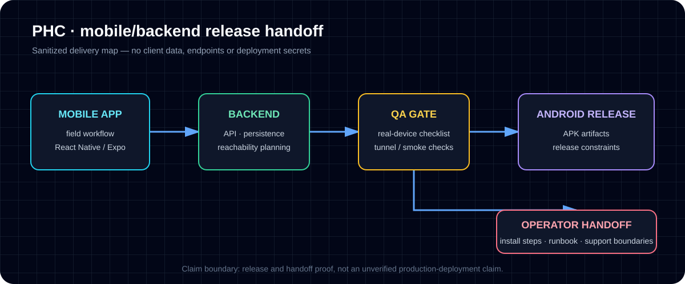

# Case Study 3 — PHC Drilling Monitoring System / Audit, Hardening and Handoff Program



## In plain terms

A water-well drilling company ran on paper. Every shift, a crew wrote down how deep they drilled and what materials they burned through, and those sheets had to travel back to the office to be typed up. Often they didn't — and the office found out days later that a well was behind or a material had run out.

Now the crew records it on a phone at the well site, including where there's no signal, and it syncs when they're back in range. The office sees project progress live, approves material orders as they come in, and receives a signed technical report when a well is finished.

The interesting work wasn't the screens. It was proving the thing was correct before real crews depended on it, and making sure it keeps running after I hand it over.

## Problem

A water-well drilling contractor needed to replace paper shift reports with a system operators could actually use in the field: crews record drilling progress and material usage on Android devices, often with poor connectivity, while the office needs live project status, material orders, and signed closure reports.

The hard part was never "build some screens." It was everything around them — deciding where the backend should live in a country with limited hosting options, keeping field devices working offline, proving the workflows were correct before real crews depended on them, and handing the whole thing over so it keeps running without me.

## My role

I ran the delivery and operations side of this system end to end: requirements gap analysis, a staged audit-and-remediation program, infrastructure option research with costs, automated end-to-end test coverage, the Android release cadence, production backup automation, and the client handoff documentation.

The implementation is AI-assisted throughout. My contribution is the part that makes AI-assisted building safe to ship: defining what correct means, verifying it independently, and writing down what the next person needs to know.

## Workflow/system designed

**System shape.** Three coordinated parts — a React Native field app, a web admin console, and a Supabase (Postgres) backend — covering the real business loop: project setup → crew assignment → shift start → drilling progress → material orders and receipts → shift closure → technical report → signature.

**Staged audit-and-remediation program.** Rather than fixing issues ad hoc, I ran numbered passes, each with its own written record and a consolidated pass log:

| Pass | Scope |
|---|---|
| 1 | UI/UX and workflow audit — establish the defect inventory |
| 1.5 | Critical security and authentication fixes |
| 2 | Brand and UI system |
| 3 | Operator workflow correctness |
| 4 | Admin workflow correctness |
| 5 | Hardening and production safety |

Findings carry IDs and stay open in the log until a commit closes them, so "is this done?" is a lookup rather than a conversation.

**Infrastructure decision, documented.** Before committing to hosting, I researched and costed the realistic options for a Paraguay-based client — local hosting providers, AWS Lightsail, Oracle Cloud, and an on-premises office PC — and wrote each up with its tradeoffs, plus a cost breakdown for the client. The decision record matters more than the decision.

**Handoff as a deliverable.** Direct APK handoff instructions, local QA environment setup, server-PC QA handoff, an end-to-end test plan, a client readiness audit, and a final handoff document — written for the people who have to operate this, not for me.

## Tools used

- React Native / Expo (field app), web admin console
- Supabase / Postgres, with a documented migration plan
- Maestro for automated end-to-end mobile testing
- Jest for unit and screen-level tests
- GitHub Actions for scheduled production backups
- Android signed-release build and versioning workflow
- Markdown audit logs, runbooks, and handoff documentation

## Verification evidence

Everything below was confirmed by direct inspection of the repository on 2026-07-27.

**Automated end-to-end mobile coverage — 9 Maestro flows**, named after the business workflows rather than the screens, covering both roles:

```text
login-admin.yaml              login-operador.yaml
crear-proyecto-admin.yaml     iniciar-turno.yaml
crear-operador-admin.yaml     registrar-progreso.yaml
reasignar-proyecto-admin.yaml crear-pedido.yaml
navegacion-admin.yaml
```

**35 unit and screen test files** alongside the E2E layer.

**A real release cadence, not a one-off build.** Five signed release versions in nine days, plus local-QA builds pointed at a local Supabase instance so testing never touches production data:

```text
PHC_2026-07-18_release-v2.0.12-vc14.apk
PHC_2026-07-19_release-v2.0.13-vc15.apk
PHC_2026-07-19_release-v2.0.14-vc16.apk
PHC_2026-07-20_localQa-v2.0.15-vc17-local-supabase.apk
PHC_2026-07-26_release-v2.0.16-vc18.apk
```

**Production backup automation.** A scheduled GitHub Actions workflow performs a nightly off-site `pg_dump` of roles, schema and data. It fails fast when the credential is missing and verifies the dump is non-empty rather than silently producing an empty file — the failure mode that makes backups worthless.

**An ongoing written audit trail.** Architecture and workflow findings documents (2026-07-25) drove a data-layer refactor giving each domain — progress entries, material orders, water samples, operators — a single owner, with schema DDL moved out of screen components. Individual findings are tracked to closure by ID in the commit history.

## Business value

This is proof of the unglamorous work that decides whether software survives contact with real users: knowing what to verify, verifying it independently, choosing infrastructure on documented tradeoffs instead of defaults, keeping a release cadence, protecting production data, and handing over cleanly.

For AI-assisted work specifically, it demonstrates the discipline that makes it trustworthy. AI can produce a working screen quickly. It cannot tell you whether the shift-closure workflow matches what a drilling crew actually does at 6am, or whether your backup is real. That verification boundary is the job.

## Honest limitations

This is a single-client system built for a specific operation, not a general product, and the deployment is small in scale. The repository is private — it contains client operational data and credentials — so the evidence above is drawn from structure, test flows, release artifacts, automation and documentation rather than from published source.

Independent audits by others, load testing at scale, and formal uptime measurement are not part of this project's evidence.

## Next improvement

Publish sanitized architecture diagrams and a redacted screenshot set once the client has reviewed them, so the workflow design is visible without exposing operational data.
